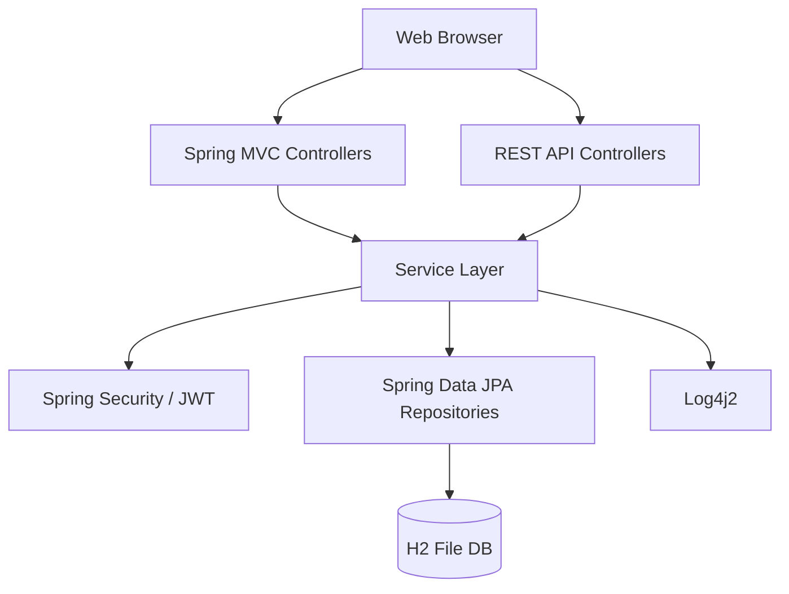
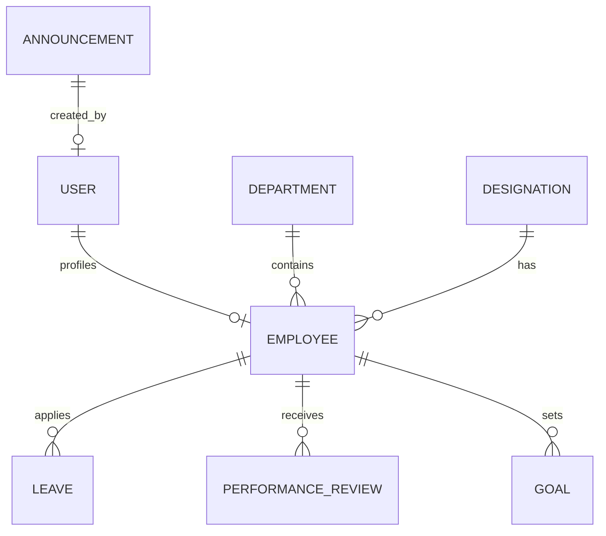

# RevWorkforce - Human Resource Management System

RevWorkforce is a comprehensive full-stack HRM solution designed to streamline employee management, leave tracking, and performance reviews. It features role-based access for Employees, Managers, and Admins.

## 🚀 Features

- **Admin Dashboard**: Department & Designation management, Employee lifecycle, System logs, and Company announcements.
- **Manager Portal**: Team leave approvals, Performance tracking, and Goal reviewing.
- **Employee Portal**: Leave applications, Personal goal tracking, and Performance feedback.
- **Security**: JWT-based REST API authentication and Session-based Web security.

## 🛠️ Technology Stack

- **Backend**: Spring Boot 3.4.3, Spring Security, Spring Data JPA.
- **Frontend**: Thymeleaf, HTML5, Vanilla CSS, FontAwesome.
- **Database**: H2 (File-based persistence).
- **Logging**: Log4j2.
- **Java Version**: JDK 17.

## 📋 Login Credentials

| Role | Username (Email) | Password |
| :--- | :--- | :--- |
| **Admin** | `sriharshamunjala2506@gmail.com` | `admin123` |
| **Manager** | `manager@rev.com` | `manager123` |
| **Employee** | `employee@rev.com` | `password` |

## 🏗️ Architecture Diagram

## 📊 Database Schema (ERD)

## ⚙️ Setup & Execution

1. **JDK 17**: Ensure Java 17 is installed.
2. **Build**: Run `./mvnw clean install` to build the app.
3. **Run**: Run `./mvnw spring-boot:run` or start from IntelliJ.
4. **Access**: Open [http://localhost:8082](http://localhost:8082) in your browser.

---
Developed by **Harsha Munjala** for Revature P2 Workforce Management project.
